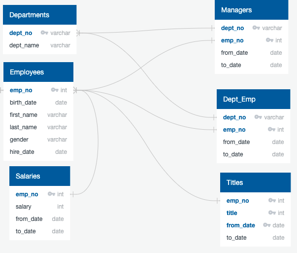

# Pewlett-Hackard-Analysis

## Overview 
The goal of this analysis is to create a list of current employees approaching retirement age born between January 1, 1952, and December 31, 1955 for Pewlett Hackard. The purpose is to prepare to hire new staff and create a mentorship program to transfer the knowledge to current employees. 

SQL was used to complete this analysis. 
 
6 CSV files was provided by Pewlett Hackard:

1. Employees 
2. Departments
3. Dept_emp
4. Dept_manager
5. Titles
6. Salaries

Here is the Entity Relationship Diagram for each table:

## Results
1. It seems like Senior Engineers have the highest number of titles retiring. It is also the biggest need of future openings
2. 70% of retiring employees have a "senior" title (50,842/ 72,458)
3. 24% of the current employees qualify to retire (72,458/300,024)
4. 1% current employees qualify for mentorship (1,549/300,024)

## Summary 
It appears that nearly 1/4 of the current workforce will be approaching retirement age and only 1% of current employees qualified to be mentor. It appears this will become an issue if we don't identify additional employees that currently can be mentor to decrease the risk of knowledge gap. 

